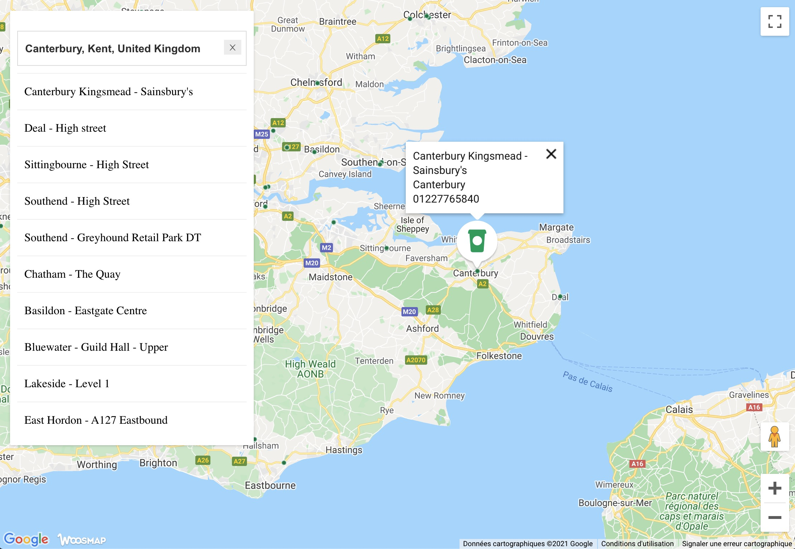

Store Locator example
---

Display a Woosmap Map tiled view with a Localities search box and an InfoWindow on store selection

### Local Development

    git clone https://github.com/woosmap/woosmap-react-examples.git

    cd woosmap-react-examples/advanced
    npm install
    npm start

    open http://localhost:3000/

Runs the app from http://localhost:3000

### Set Your Project Key and Google Maps API Key

By default, the sample app displays Starbucks Coffee, a public Woosmap Project. To display your own stores, open the file `src/config.json` and replace the `woosmapLoadOptions.publicKey` with your project Public Key and set the `googleLoadOptions.key` with your Google Maps API Key. 
Don't forget to enable the domain `localhost` for your Woosmap Project Public Key - see [here](https://developers.woosmap.com/support/api-keys/#what-is-a-woosmap-public-api-key-restriction) for more details. 